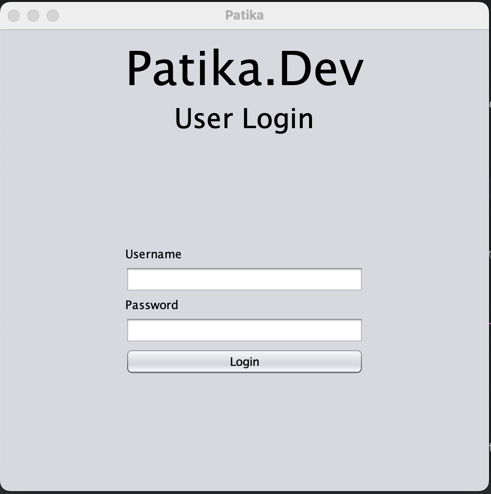
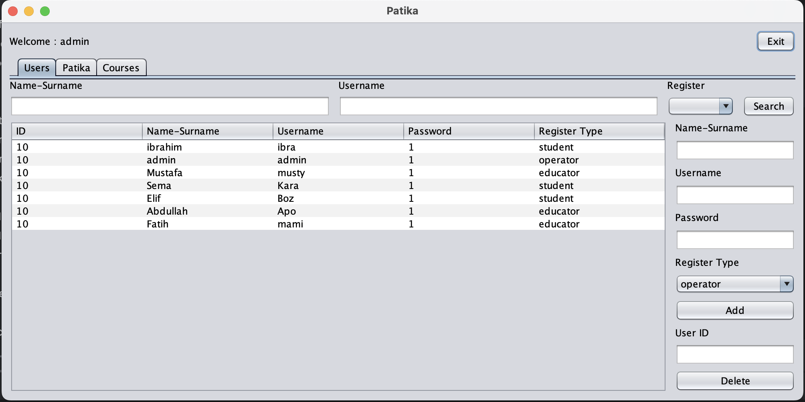
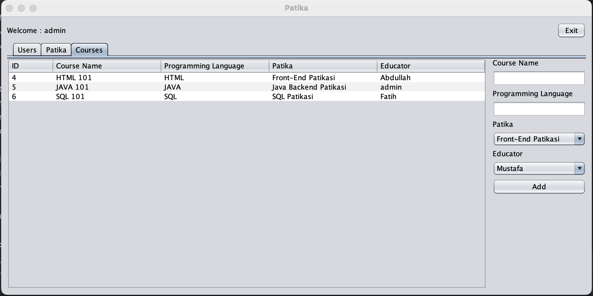
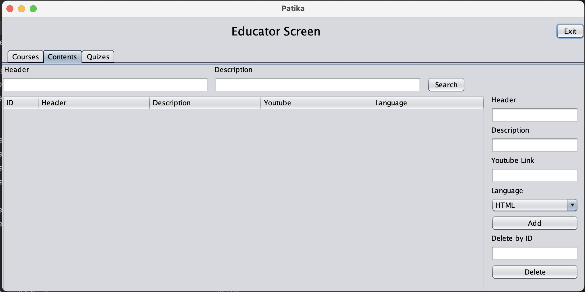
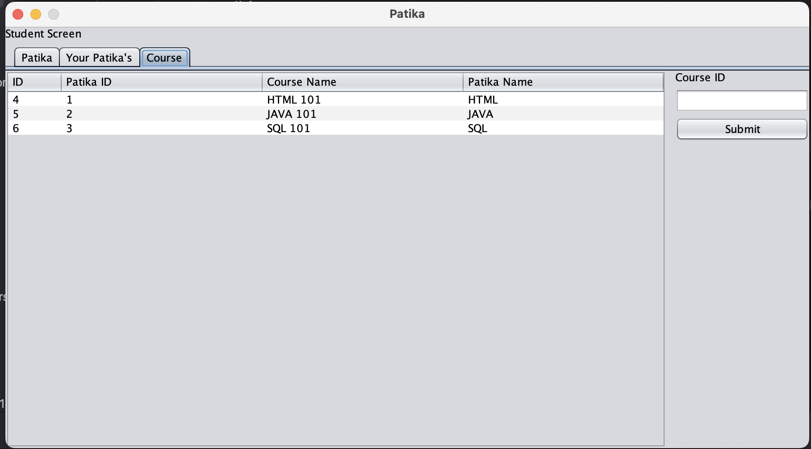

# Patika Clone  

In this project, I used java GUI effectively to create an interface. By creating database connections, I performed addition, subtraction, update operations.

# Technologies used

<table>
  <tr>
    <td align="center" >
      <b>JAVA</b>
    </td>
    <td align="center" style="padding-top: 15px;">
      
    </td>
  </tr>
 <tr>
    <td align="center" >
      <b>SQL</b>
    </td>
    <td align="center" style="padding-top: 15px;">
      
    </td>
  </tr>
</table>

# Home Screen design
I created it so that users with different memberships have separate interfaces when they enter their information.

    

# Operator interface

Operator can perform all functionality such as adding and removing lessons, assigning teachers, etc.

    

    

# Educator interface

Educator is authorized to add courses and quiz questions.

    

# Student interface

students are empowered to choose courses and pathways.

    

